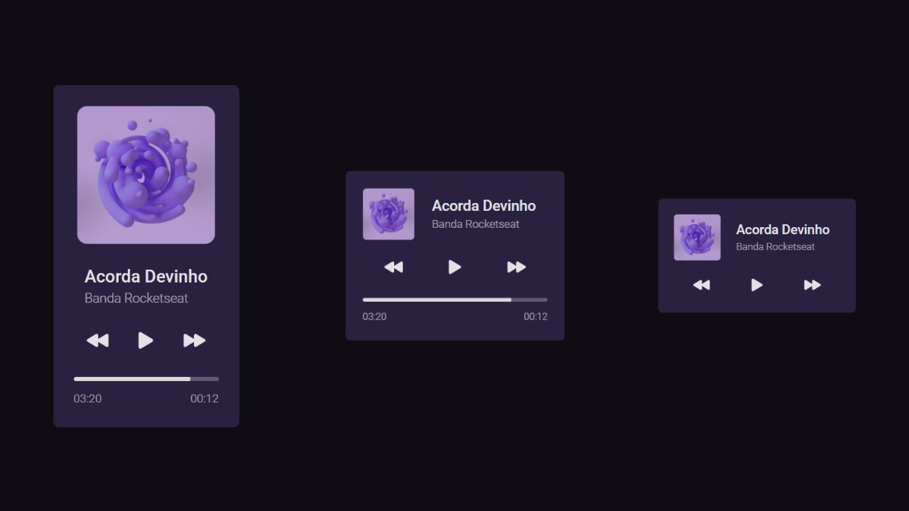

# DevPlayer

## Projeto

Player de música responsivo

## Layout

O [layout](https://www.figma.com/file/lHOrVOvkZAkIB9iQzLXrTJ/%23boraCodar---Desafio-1?node-id=1%3A61&t=KoYnHIzYMoVgkZl5-1) desse projeto está hospedado no [Figma](htttps://figma.com). Para acessá-lo, você precisa de uma conta!

## Referências

- [Building an Audio Player in React](https://brad-carter.medium.com/building-an-audio-player-in-react-136fc684d16c)
- [How to Style an Audio Element](https://blog.shahednasser.com/how-to-style-an-audio-element/)
- [HTML audio Tag](https://www.w3schools.com/tags/tag_audio.asp)

## Tecnologias

- React
- Typescript
- TailwindCSS
- Figma

## Features

- [ ] Reprodução de faixas
- [ ] Timer de reprodução
- [x] Layout Web responsivo

## Licença

Este projeto está sob a licença MIT. Para mais informações, acesse [LICENSE](LICENSE).
